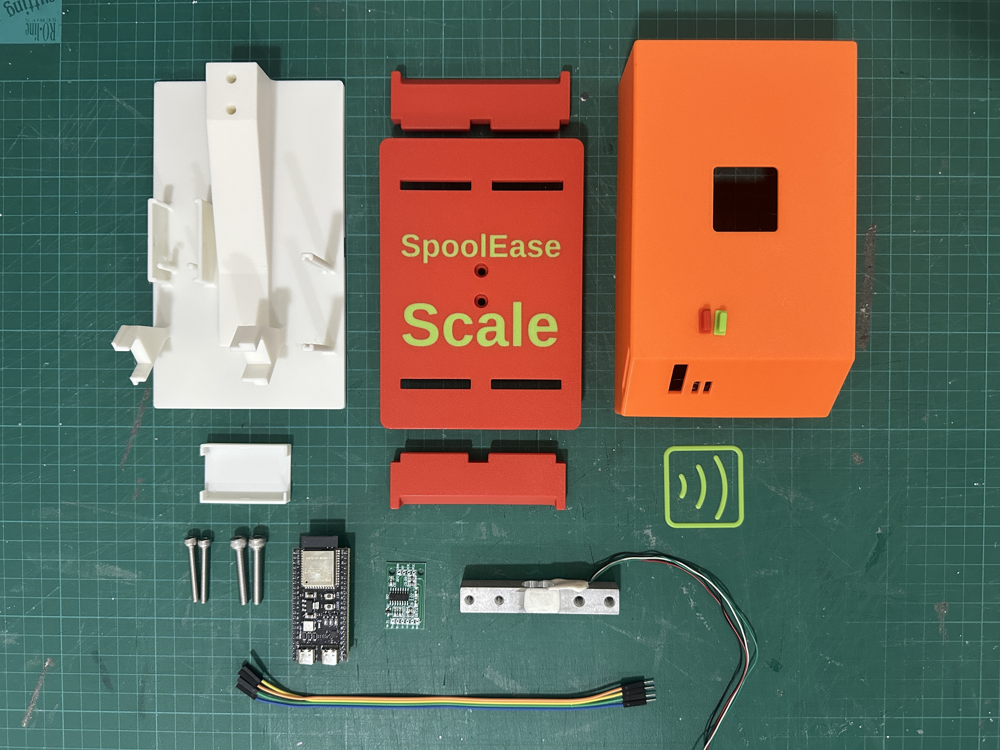

# SpoolEase Scale Components
- **[ESP32-S3-DevKit N16R8 board](https://www.aliexpress.com/item/1005005051294262.html)**  
  **Important**: Select the **ESP32-S3 N16R8 welded version**. This specific model is required due to its memory configuration—other variants will not work. The welded version avoids difficult pin soldering, making assembly easier. The 3D case was also designed around this board’s exact dimensions and component layout, including button and LED placement.  
  If you’re sourcing the board from a different supplier, double-check that it’s the exact same version. Look closely at the physical layout, available pins, and component positions—similar-looking DevKits exist, but may not be compatible.

- **[HX711 AD Module + LoadCell](https://www.aliexpress.com/item/1005001537354199.html)**  
  Select a LoadCell based on the heaviest spool you plan to measure. Typical 1kg spools usually weigh around 1.25kg. Choose a 2-5kg capacity load cell for optimal accuracy. SpoolEase Scale has been tested with 2kg and 3kg load cells.

- **[Dupont Wire Cable](https://www.aliexpress.com/item/1005008248101491.html)**  
  These wires connect the the ESP32-S3 to the HX711 and optionally to the PN532 module.
  - HX711 connection: 10cm length is sufficient (4 wires required)
  - PN532 connection: 20cm length recommended (7 wires required)
  - At least one side must be Female to connect to the ESP32-S3 pins
  - The other end depends on your preferred connection method:
    - Solder connectors to the boards (requires Female wire ends)
    - Solder Dupont Male pins to the boards
    - Direct soldering (wire end type irrelevant as it will be cut)

- **2x M5x30 Socket head screws**

- **2x M4x30 Socket head screws**

- [**Printed 3D Model parts for the SpoolEase Scale case**](https://makerworld.com/en/models/1323092)  
  While printing the model, feel free to boost it, and Star the GitHub Repo. Thanks!

- **Optional: [PN532 NFC reader module](https://www.aliexpress.com/item/3256806852006648.html)** (ensure you select the module, not accessories)  
  Currently serves as an extra tag scanning point. Future features may utilize this scanning point differently than the main SpoolEase console.

**Additional tools required:**
- Soldering equipment

