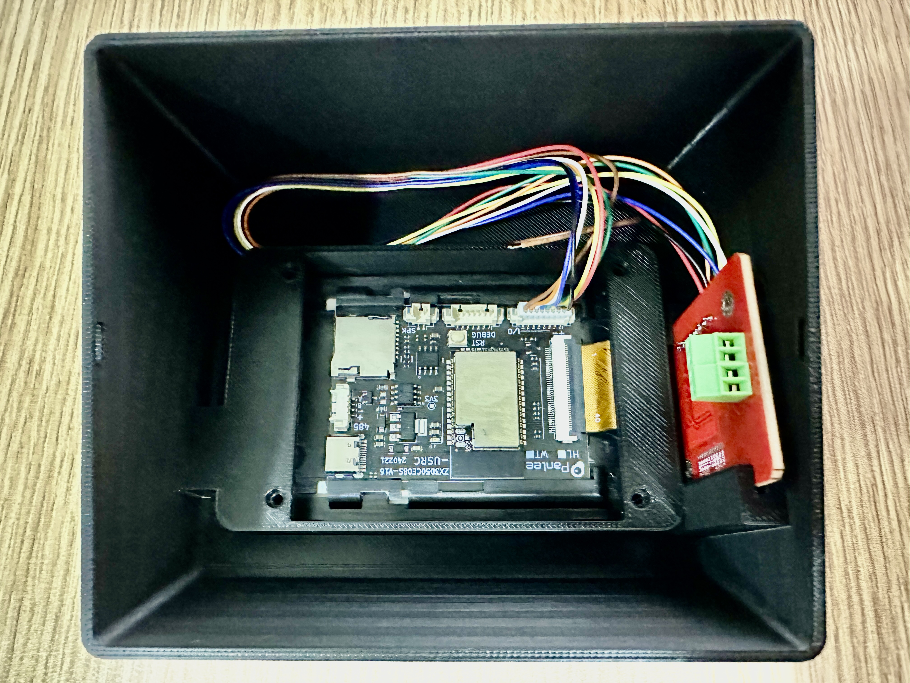

# SpoolEase Console Build Guide

This guide provides step-by-step instructions for connecting the WT32-SC01-Plus board to a PN532 NFC module.

Once wiring is done, print the 3D Model of SpoolEase Console and fit the WT32-SC01-Plus into its location, the PN532 to its location with the Antenna facing outwards, use screws wherever required and close the case. Make sure that the wiring don't interfere with the NFC reception.

Build is done.

### Connector Placement

The WT32-SC01-Plus has two connectors:

- A **7-pin** connector
- An **8-pin** connector

To ensure proper operation, insert the **7-wire cable into the 8-pin connector**, leaving one pin free. Align the cable so that it covers the first 7 pins, beginning from the pin marked with a **'+'** symbol.

### Wire Preparation

The provided 7-wire cable has connectors on both ends. However, since the PN532 module requires soldering, follow these steps:

1. Cut off one connector from the 7-wire cable.
2. Strip the insulation to expose the wire ends for soldering.

### Wiring Instructions

:::warning
IMPORTANT: The wiring follows the pin number on the display and the signal name on the PN532. Some devices may come with wire colors in a different order (e.g., sometimes 🟩 green and 🟨 yellow reversed in the received wires). Always connect by pin number and signal name, not by wire color.
:::

| Wire # | Color  | WT32-SC01-Plus Pin | PN532 Connection |
|--------|--------|--------------------|------------------|
| 1      | 🟥 **Red** | +                | VCC              |
| 2      | ⬛ **Black** | -                | GND              |
| 3      | 🟩 **Green** |                 | SS               |
| 4      | 🟨 **Yellow** |                 | MOSI             |
| 5      | 🟦 **Blue** |                 | MISO             |
| 6      | ⚪ **White** |                 | SCK              |
| 7      | 🟧 **Orange** |                 | IRQ              |

### Configuring the PN532

:::warning
IMPORTANT: Many users don't notice this step. Make sure you do it now !
:::
The PN532 has two small dip switches that must be set to SPI mode.
With the board oriented so that the dip switches are at the bottom right, set the left switch down and the right switch up.

## Tips/Recommendations

- Solder the wires to pass on the opposite side of the antenna to prevent interference with NFC reception. The antenna is the thick white line around the board (note that the photo does not follow this guideline).
- Keep the wires to the necessary length. Consider the required length to assemble everything (including the ability to remove the display with the PN532 inside), how to route them within the case to avoid interfering with the WiFi antenna, and other factors. Excessively long wires can cause electrical interference.

### Reference Image

Add the wiring diagram image here:

### Installing the Case

- Print the 3D model from [this link](https://makerworld.com/en/models/1138678).  
  - While printing, feel free to boost the model :smile:  
  - Optionally, glue the small pieces forming the antenna icon on the side, indicating where to place the tag. Ensure correct orientation before gluing, so check for fit first.
- Format the SD card using the classic FAT file system. You can do this directly with your Bambulab printer. If formatting on a computer, ensure you select the original FAT format, not any of the newer variants introduced over the years.
:::warning
Windows may have issues formatting SD cards with FAT for use with SpoolEase, especially when using third-party tools on large cards.  
If you encounter errors in SpoolEase related to storing or accessing files right after setup, use a Bambu Lab printer to format the SD card, as this method is known to work reliably.
:::
- Insert the microSD card into the slot in the WT32-SC01-Plus just below the USB connector. You should feel it click into place. To remove it, press it again and it will pop out.  
- Place the WT32-SC01-Plus and PN532 in the positions shown in the image below.  
  - Make sure the antenna faces outward from the case.  
  - There is a hidden slot on the opposite side of the visible slot where the other end of the PN532 module fits.  
  - Arrange the wires to avoid interfering with the PN532 antenna or the WT32-SC01-Plus board (to minimize Wi-Fi interference).  
  - Secure the WT32-SC01-Plus with M2x10 screws. If you don’t have them, the board remains stable without screws.  
- Carefully place the cover so the PN532 slides into the slots on the cover.
- Fit the USB cable into the slot of the WT32-SC01-Plus. Depending on the stiffness of your cable, it may be tricky due to the board design. If it’s difficult to connect while the board is in place, try connecting the cable before placing the board.  

## Congratulations! Build is Done
#### You are the proud owner of SpoolEse Console

Continue to complete the setup using the [Console Setup Guide](console-setup)

