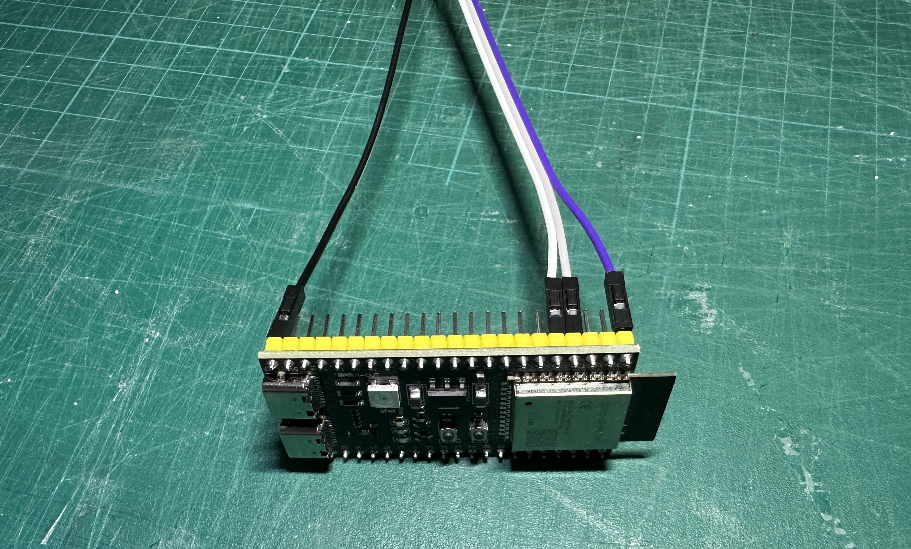
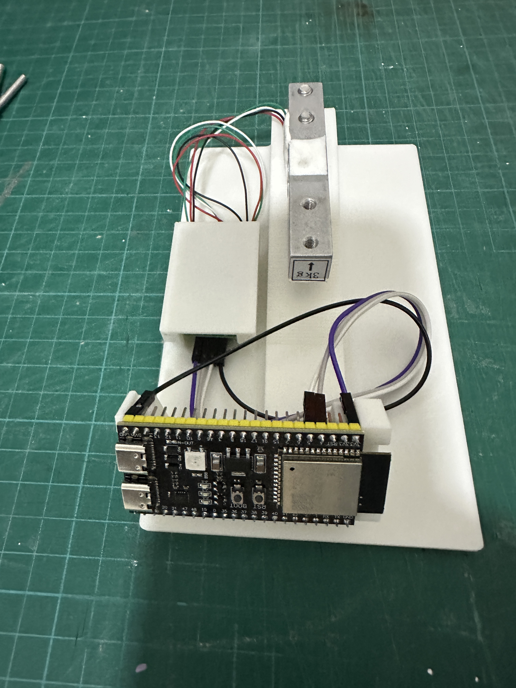
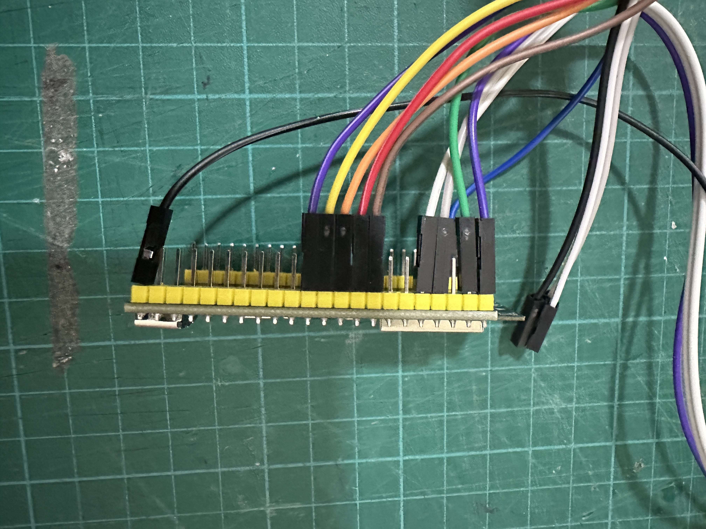
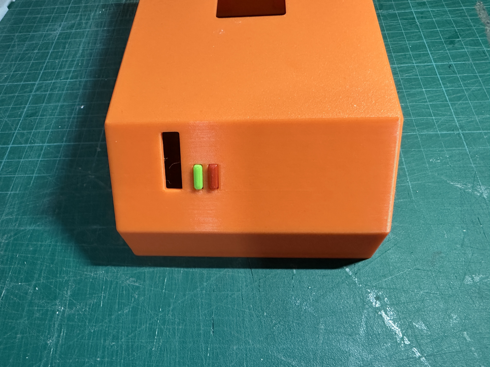
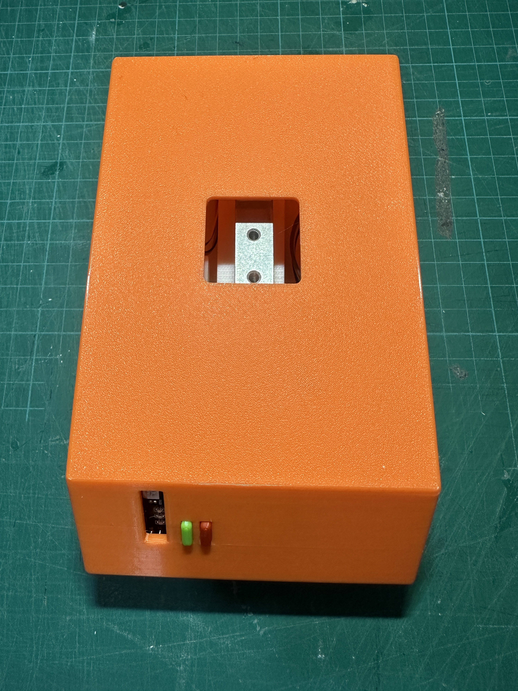

# SpoolEse Scale Build Guide

This guide provides step-by-step instructions for building SpoolEase Scale - the filament weight module of the SpoolEase system.

## Preparing the ESP32-S3
- To enable the front RGB LED functionality, solder a small jumper (two adjacent pads) on the board.
- This jumper is located directly adjacent to the large RGB LED, marked with 'RGB' label nearby.
- Only a minimal amount of solder is required for this connection.
- Verify successful bridging by using a multimeter to check continuity between pin 48 and any of the four red pins (only one would show continuity).
- While not mandatory, this step is highly recommended as it provides valuable status feedback from the SpoolEase Scale, particularly when not connected to the SpoolEase Console.
- Check the images below - first one Before bridging and the other After bridging

## Assembly Instructions

### 1. HX711 Wiring

The HX711 PCB has connection points on both sides:
- One side has 4 holes for ESP32-S3 connections
- The other side has 6 holes (only 4 used) for load cell connections

Begin by soldering the ESP32-S3 side connections (all 4 holes need to be wired). For the load cell side, precise wiring is critical. A helpful technique: insert wires through the holes, secure with masking tape, then solder from the opposite side.

**Load Cell to HX711 Connection:**

| Load Cell Wire Color | HX711 Pin |
|----------------------|-----------|
| 🟥 **Red**           | E+        |
| ⬛ **Black**         | E-        |
| ⚪ **White**         | A-        |
| 🟩 **Green**         | A+        |

### 2. Connect HX711 to ESP32-S3

Connect the HX711 to the ESP32-S3 using the following pin mapping:

| HX711 Pin | ESP32-S3 Pin |
|-----------|--------------|
| GND       | GND          |
| DT        | 5            |
| SCK       | 4            |
| VCC       | 3V3          |

Note: The ESP32-S3 GND is on one side of the board, while the other pins are on the opposite corner.

### 3. Mount the LoadCell

- Attach the load cell to the base using the two M5x30 screws
- Position the load cell so that the wires come out to the left
- Insert screws from the bottom of the base
- Tighten firmly to prevent any vertical movement of the load cell

### 4. Install HX711 and ESP32-S3 on the Base

1. **HX711 Placement:**
   - Locate the small compartment on the left side of the base with two 3mm poles
   - Slide the HX711 (which has two 3mm holes) onto these poles
   - Optionally install the appropriate HX711 lid (model includes two options) depending on your connector type

2. **ESP32-S3 Placement:**
   - Position the ESP32-S3 in its designated location at the front
   - Ensure it sits fully in place with all connections secure, it should have only very little room to move sideways if any
   - The ESP32-S3 antenna should be positioned on the right side

### 5. Optional PN532 Installation

As mentioned earlier, this step is optional and only needed if you want to add a tag reader to SpoolEase Scale. However, if you skip it, make sure to disable the NFC module in the SpoolScale Web Config to avoid errors.

1. **Connect wires to PN532:**
   - Similar to the HX711, connect 7 Dupont wires to the PN532
   - Install wires so they come out on the side opposite to the antenna (not the electronics side) (**image below is a bad example and doesn't follow this recommendation**)
   - Configure the PN532 for SPI mode: with board poitioned so dip-switches on bottom right, set left switch down and right switch up

:::warning
IMPORTANT: Many users miss the last step above about the dip-switches. Make sure you do it now !
:::

2. **Connect PN532 to ESP32-S3:**

   | PN532 Pin | ESP32-S3 Pin                   |
   |-----------|--------------------------------|
   | SCK       | 15                             |
   | MISO      | 16                             |
   | MOSI      | 17                             |
   | SS        | 18                             |
   | VCC       | 3V3 (next to HX711 connection) |
   | GND       | GND (next to HX711 connection) |
   | IRQ       | 8                              |

3. **Install PN532 on Base:**
   - Place the PN532 into the rails on the right side of the base
   - Position the antenna (white rectangle) facing outward
   - Direct wires toward the rear of the case (they will turn back to reach the ESP32-S3)
   - The narrow side of the PN532 should be parallel to the base

### 6. Test Before Final Assembly

At this point, test your configuration before closing the case. For this, refer to the [Scale Setup Guide](scale-setup) to ensure everything is functioning properly. This step is crucial as disassembly will require removing screws if troubleshooting is needed later.

### 7. Final Assembly

1. **Prepare the Cover:**
   - Glue the beams to the right side of the case (especially helpful for visibility to the position of the PN532)
   - Locate the two small buttons (originally colored red and green)
   - Insert buttons from inside the cover pushing outward (red, for reset, to the right, green, for features use, to the left)
   - Ensure buttons move freely (sand lightly if needed)
   - Temporarily secure buttons with masking tape from the outside

2. **Wire Management:**
   - Verify the ESP32-S3 is properly positioned
   - Ensure all wires are clear of the load cell
   - Keep wires below or to the sides of components, not extending beyond base edges

3. **Attach Cover:**
   - Carefully place the cover over the base without pinching any wires
   - Secure the cover using the two side notches that lock into the base
   - Remove the masking tape from the buttons
   - Test button functionality - you should feel them pressing the underlying board buttons
   - The front vertical slot should reveal three LEDs at the bottom and a larger RGB LED at the top

### 8. Install the Plate

1. Insert the two Spool Supports into the plate:
   - Position the sloped side of each support facing the center
   - Ensure a tight fit in the plate holes, it may require some force to push them in (or add glue if hold not firm)

2. Mount the plate:
   - Place the plate with text facing to the front into the top square hole of the case
   - Secure the plate to the LoadCell using the two M4x30 screws

## Congratulations!
#### You are the proud owner of SpoolEse Scale

Continue to complete the setup using the [Scale Setup Guide](scale-setup)

