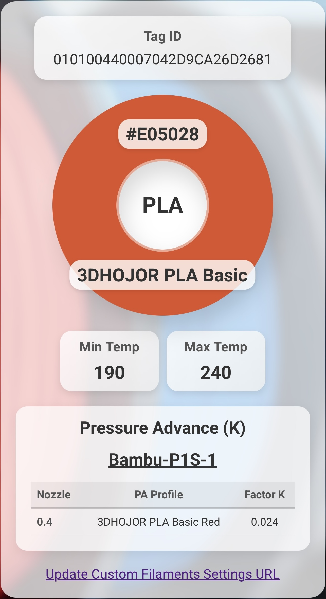

# Viewing Spool Tag Information  

If you want to see the information stored on your NFC tag in a clear and organized way, simply scan the tag with your mobile phone. Ensure NFC is enabled (on Android, it may be disabled by default). You'll be redirected to a web page displaying the encoded tag information—a "Virtual Spool Tag."  
  

