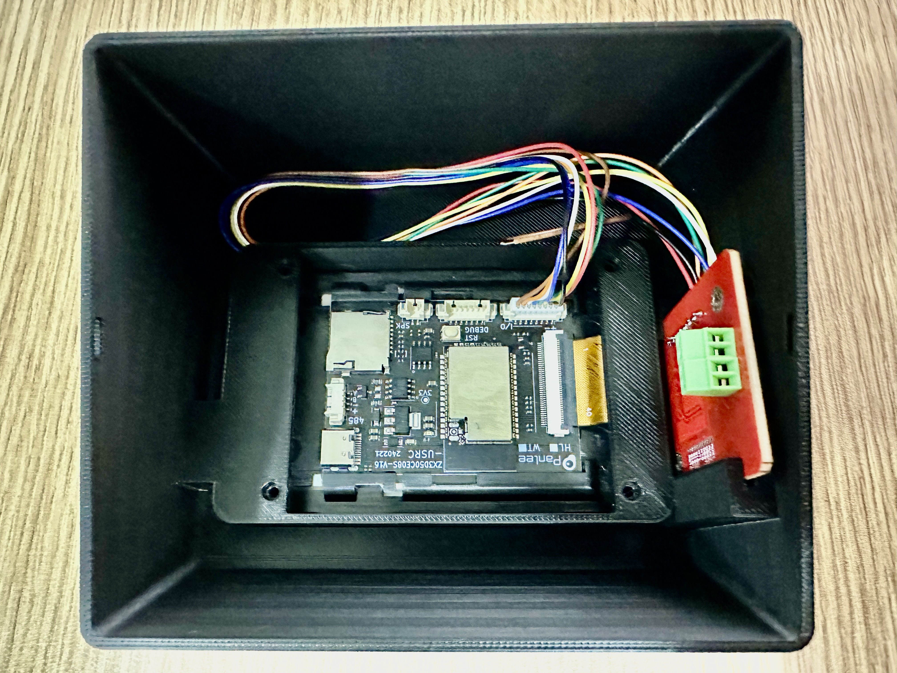

# SpoolEase Console Bauanleitung

Diese Anleitung bietet eine Schritt-für-Schritt-Anleitung zum Anschluss des WT32-SC01-Plus-Boards an ein PN532-NFC-Modul.

Sobald die Verdrahtung abgeschlossen ist, drucken Sie das 3D-Modell der SpoolEase-Console und setzen Sie das WT32-SC01-Plus an seinen Platz, das PN532 an seinen Platz mit nach außen gerichteter Antenne, verwenden Sie Schrauben, wo erforderlich, und schließen Sie das Gehäuse. Achten Sie darauf, dass die Verdrahtung den NFC-Empfang nicht beeinträchtigt.

Der Aufbau ist abgeschlossen.

### Anschlussplatzierung

Das WT32-SC01-Plus verfügt über zwei Anschlüsse:

- Einen **7-poligen** Anschluss
- Einen **8-poligen** Anschluss

Um den ordnungsgemäßen Betrieb sicherzustellen, stecken Sie das **7-adrige Kabel in den 8-poligen Anschluss**, wobei ein Pin frei bleibt. Richten Sie das Kabel so aus, dass es die ersten 7 Pins abdeckt, beginnend bei dem mit einem **'+'** Symbol markierten Pin.

### Kabelvorbereitung

Das mitgelieferte 7-adrige Kabel hat an beiden Enden Stecker. Da das PN532-Modul jedoch gelötet werden muss, befolgen Sie diese Schritte:

1. Schneiden Sie einen Stecker vom 7-adrigen Kabel ab.
2. Entfernen Sie die Isolierung, um die Drahtenden zum Löten freizulegen.

### Verdrahtungsanweisungen

Hinweis: Die Verdrahtung folgt der Pinnummer am Display und dem Signalnamen am PN532. Manche Geräte können Kabel in einer anderen Reihenfolge haben (z. B. Grün und Gelb vertauscht). Verbinden Sie immer nach Pinnummer und Signalnamen, nicht nach Kabelfarbe.

| Draht # | Farbe  | WT32-SC01-Plus Pin | PN532 Anschluss |
|---------|--------|--------------------|-----------------|
| 1       | 🟥 **Rot** | +                | VCC             |
| 2       | ⬛ **Schwarz** | -                | GND             |
| 3       | 🟩 **Grün** |                 | SS              |
| 4       | 🟨 **Gelb** |                 | MOSI            |
| 5       | 🟦 **Blau** |                 | MISO            |
| 6       | ⚪ **Weiß** |                 | SCK             |
| 7       | 🟧 **Orange** |                 | IRQ             |

### Konfiguration des PN532

Der PN532 hat zwei kleine DIP-Schalter, die auf SPI-Modus eingestellt werden müssen.  
Wenn das Board so ausgerichtet ist, dass sich die DIP-Schalter unten rechts befinden, stellen Sie den linken Schalter nach unten und den rechten nach oben.

## Tipps/Empfehlungen

- Löten Sie die Kabel so, dass sie auf der gegenüberliegenden Seite der Antenne verlaufen, um Störungen beim NFC-Empfang zu vermeiden. Die Antenne ist die dicke weiße Linie um das Board (beachten Sie, dass das Foto dieser Richtlinie nicht folgt).  
- Halten Sie die Kabel auf die notwendige Länge. Berücksichtigen Sie die erforderliche Länge, um alles zusammenzubauen (einschließlich der Möglichkeit, das Display mit dem PN532 im Inneren zu entfernen), wie Sie sie im Gehäuse verlegen, um Störungen mit der WiFi-Antenne zu vermeiden, und andere Faktoren. Zu lange Kabel können elektrische Störungen verursachen.

### Referenzbild

Fügen Sie hier das Verdrahtungsdiagramm ein:

### Einbau des Gehäuses

- Drucken Sie das 3D-Modell von [diesem Link](https://makerworld.com/en/models/1138678).  
  - Während des Druckens können Sie das Modell gerne verbessern :smile:  
  - Optional: Kleben Sie die kleinen Teile, die das Antennensymbol an der Seite bilden, an, um anzuzeigen, wo das Tag platziert werden soll. Achten Sie auf die richtige Ausrichtung, bevor Sie kleben, also prüfen Sie zuerst den Sitz.  
- Optional: Setzen Sie die microSD-Karte in den Steckplatz im WT32-SC01-Plus direkt unterhalb des USB-Anschlusses ein. Sie sollten ein Einrasten spüren. Zum Entfernen erneut drücken, und sie springt heraus.  
- Platzieren Sie das WT32-SC01-Plus und das PN532 an den in der Abbildung unten gezeigten Positionen.  
  - Achten Sie darauf, dass die Antenne nach außen aus dem Gehäuse zeigt.  
  - Auf der gegenüberliegenden Seite des sichtbaren Schlitzes befindet sich ein versteckter Schlitz, in den das andere Ende des PN532-Moduls passt.  
  - Ordnen Sie die Kabel so, dass sie die Antenne des PN532 oder das WT32-SC01-Plus-Board nicht stören (zur Minimierung von Wi-Fi-Störungen).  
  - Befestigen Sie das WT32-SC01-Plus mit M2x10-Schrauben. Wenn Sie keine haben, bleibt das Board auch ohne Schrauben stabil.  
- Setzen Sie die Abdeckung vorsichtig so auf, dass der PN532 in die Schlitze der Abdeckung gleitet.  
- Führen Sie das USB-Kabel in den Schlitz des WT32-SC01-Plus ein. Abhängig von der Steifigkeit Ihres Kabels kann dies aufgrund des Board-Designs schwierig sein. Wenn es schwer ist, das Kabel anzuschließen, während das Board eingesetzt ist, versuchen Sie, das Kabel vor dem Einsetzen des Boards anzuschließen.  

## Herzlichen Glückwunsch! Der Aufbau ist abgeschlossen
#### Sie sind nun stolzer Besitzer der SpoolEase-Console

Fahren Sie mit der Einrichtung mithilfe der [Console-Einrichtungsanleitung](console-setup.md) fort.

