# SpooolEase Scale Build Anleitung

Dieser Leitfaden bietet Schritt-für-Schritt-Anweisungen zum Bau der SpoolEase Scale – dem Filamentgewicht-Modul des SpoolEase-Systems.

## Vorbereitung des ESP32-S3
- Um die Funktionalität der vorderen RGB-LED zu aktivieren, löten Sie einen kleinen Jumper (zwei benachbarte Pads) auf der Platine.
- Dieser Jumper befindet sich direkt neben der großen RGB-LED, mit der Beschriftung 'RGB' in der Nähe.
- Für diese Verbindung ist nur eine minimale Menge Lötzinn erforderlich.
- Überprüfen Sie die erfolgreiche Verbindung mit einem Multimeter, indem Sie die Durchgängigkeit zwischen Pin 48 und einem der vier roten Pins testen (nur einer zeigt Durchgang).
- Obwohl nicht zwingend erforderlich, wird dieser Schritt dringend empfohlen, da er wertvolles Statusfeedback von der SpoolEase Scale liefert, insbesondere wenn sie nicht mit der SpoolEase Console verbunden ist.
- Prüfen Sie die folgenden Bilder – das erste vor dem Brücken und das andere nach dem Brücken

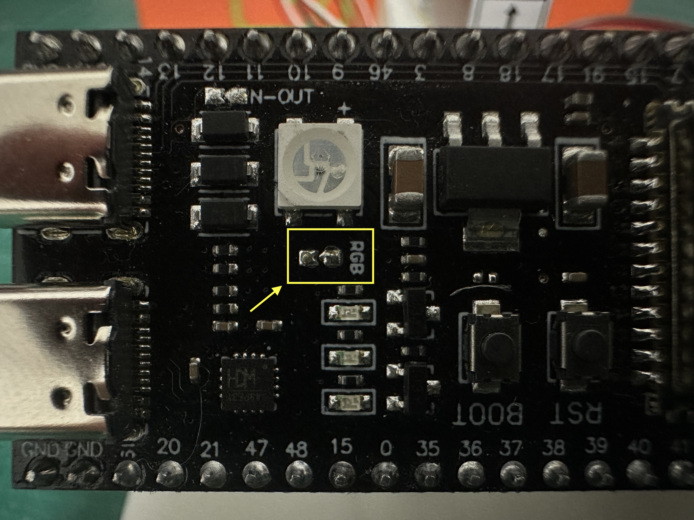

## Montageanleitung

### 1. HX711 Verkabelung

Die HX711-PCB hat Anschlussstellen auf beiden Seiten:
- Eine Seite hat 4 Löcher für ESP32-S3-Verbindungen
- Die andere Seite hat 6 Löcher (nur 4 verwendet) für die Lastzellenverbindungen

Beginnen Sie mit dem Löten der ESP32-S3-Seitenanschlüsse (alle 4 Löcher müssen verdrahtet werden). Für die Lastzellenseite ist präzises Verdrahten entscheidend. Eine hilfreiche Technik: Drücken Sie die Drähte durch die Löcher, sichern Sie sie mit Klebeband und löten Sie dann von der gegenüberliegenden Seite.

**Lastzelle zu HX711 Verbindung:**

| Lastzellen-Drahtfarbe | HX711 Pin |
|-----------------------|-----------|
| 🟥 **Rot**            | E+        |
| ⬛ **Schwarz**        | E-        |
| ⚪ **Weiß**           | A-        |
| 🟩 **Grün**           | A+        |

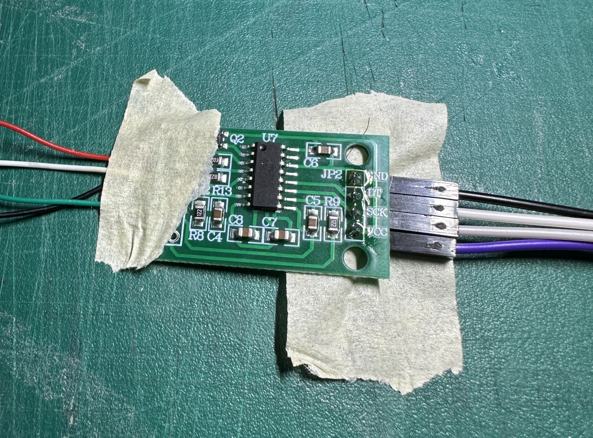
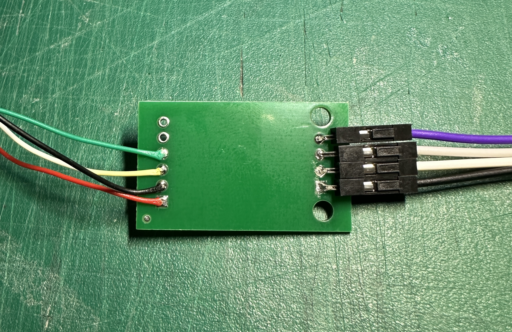
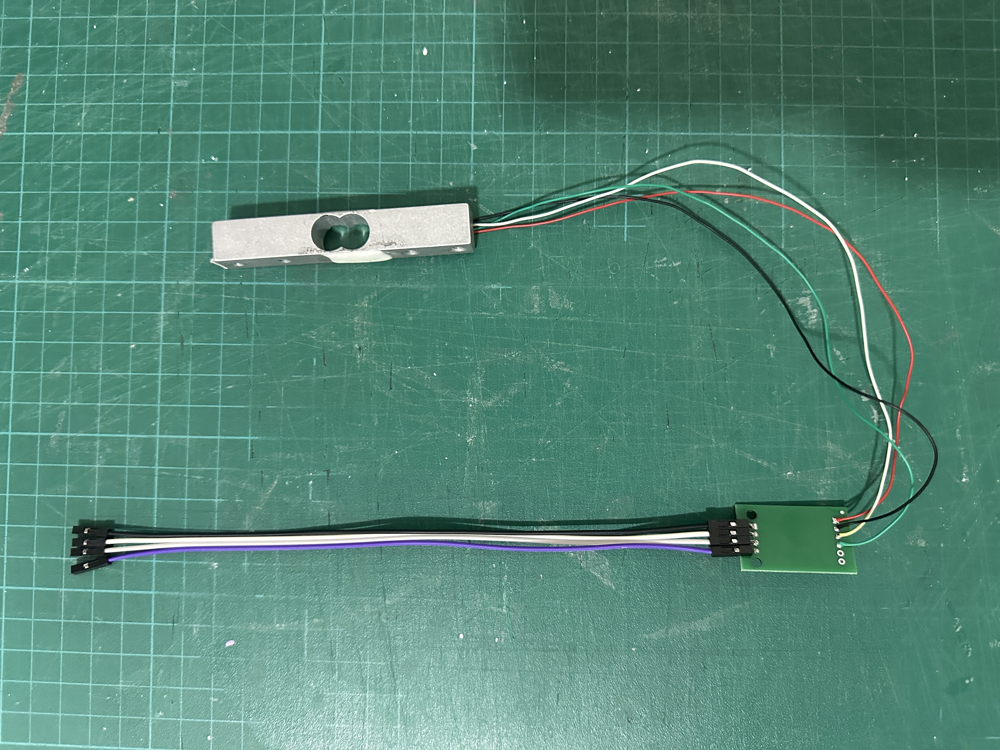

### 2. HX711 mit ESP32-S3 verbinden

Verbinden Sie den HX711 mit dem ESP32-S3 unter Verwendung der folgenden Pinbelegung:

| HX711 Pin | ESP32-S3 Pin |
|-----------|--------------|
| GND       | GND          |
| DT        | 5            |
| SCK       | 4            |
| VCC       | 3V3          |

Hinweis: Das GND des ESP32-S3 befindet sich auf einer Seite der Platine, während die anderen Pins in der gegenüberliegenden Ecke liegen.
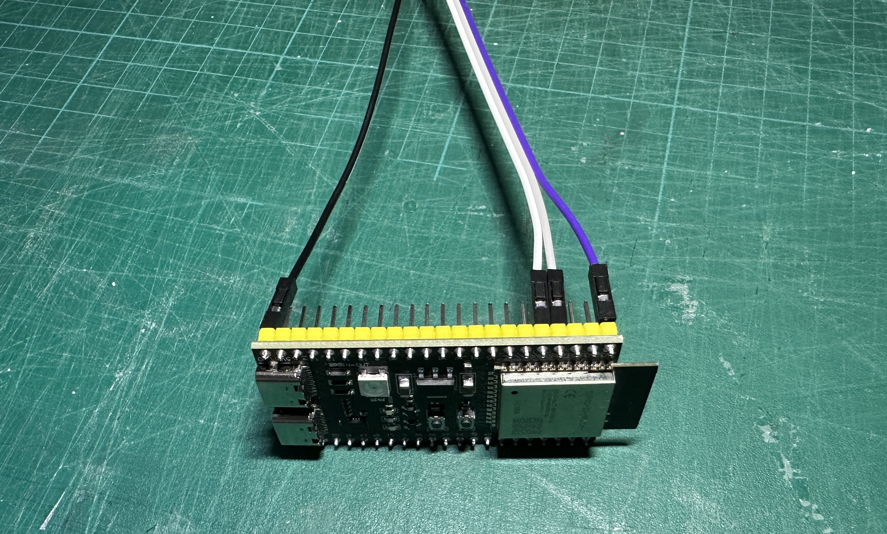

### 3. Lastzelle montieren

- Befestigen Sie die Lastzelle mit den beiden M5x30-Schrauben an der Basis
- Positionieren Sie die Lastzelle so, dass die Drähte nach links herauskommen
- Schrauben Sie von der Unterseite der Basis ein
- Ziehen Sie fest, um vertikale Bewegungen der Lastzelle zu verhindern

### 4. HX711 und ESP32-S3 auf der Basis installieren

1. **HX711 Platzierung:**
   - Finden Sie das kleine Fach auf der linken Seite der Basis mit zwei 3mm-Stiften
   - Schieben Sie den HX711 (mit zwei 3mm Löchern) auf diese Stifte
   - Optional die passende HX711-Abdeckung installieren (Modell enthält zwei Optionen) abhängig vom verwendeten Steckertyp

2. **ESP32-S3 Platzierung:**
   - Positionieren Sie den ESP32-S3 an seinem vorgesehenen Platz vorne
   - Stellen Sie sicher, dass er vollständig sitzt und alle Verbindungen gesichert sind; er sollte nur sehr wenig seitlich Spiel haben
   - Die ESP32-S3-Antenne sollte auf der rechten Seite positioniert sein

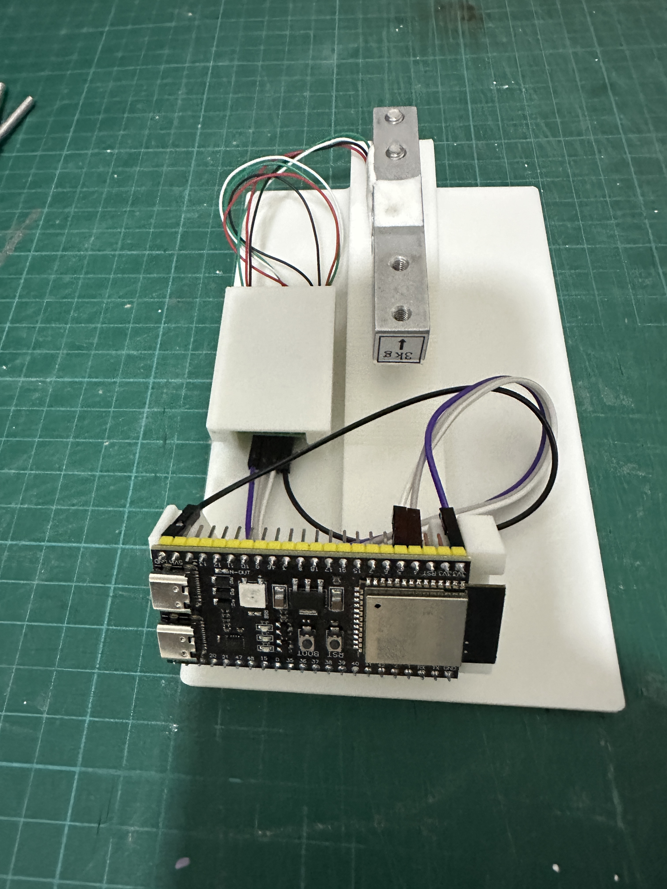

### 5. Optionale PN532 Installation

Wie zuvor erwähnt, ist dieser Schritt optional und nur erforderlich, wenn ein Tag-Leser zur SpoolEase Scale hinzugefügt werden soll. Wenn Sie ihn überspringen, deaktivieren Sie das NFC-Modul in der SpoolScale Web-Konfiguration, um Fehler zu vermeiden.

1. **Drähte an PN532 anschließen:**
   - Ähnlich wie beim HX711, 7 Dupont-Drähte am PN532 anschließen
   - Drähte so installieren, dass sie auf der dem Antennenanschluss gegenüberliegenden Seite herauskommen (nicht auf der Elektronikseite) (**Bild unten ist ein schlechtes Beispiel und folgt dieser Empfehlung nicht**)
   - PN532 auf SPI-Modus einstellen: Platine so positionieren, dass die Dip-Schalter unten rechts liegen, linken Schalter nach unten und rechten Schalter nach oben stellen

2. **PN532 mit ESP32-S3 verbinden:**

   | PN532 Pin | ESP32-S3 Pin                   |
   |-----------|--------------------------------|
   | SCK       | 15                             |
   | MISO      | 16                             |
   | MOSI      | 17                             |
   | SS        | 18                             |
   | VCC       | 3V3 (neben HX711-Verbindung)  |
   | GND       | GND (neben HX711-Verbindung)  |
   | IRQ       | 8                              |

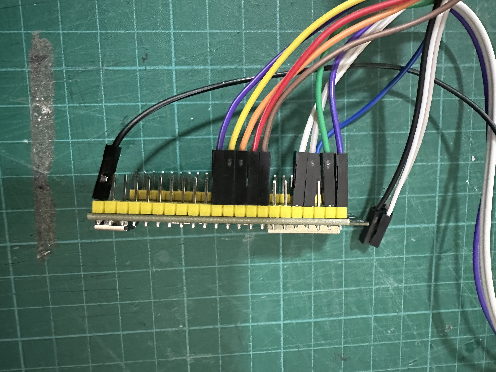

3. **PN532 auf der Basis installieren:**
   - PN532 in die Schienen auf der rechten Seite der Basis setzen
   - Antenne (weißes Rechteck) nach außen ausrichten
   - Drähte Richtung Rückseite des Gehäuses führen (sie biegen zurück, um den ESP32-S3 zu erreichen)
   - Die schmale Seite des PN532 sollte parallel zur Basis verlaufen

### 6. Test vor der endgültigen Montage

Testen Sie Ihre Konfiguration, bevor Sie das Gehäuse schließen. Nutzen Sie hierfür den [Scale Setup Guide](scale-setup), um sicherzustellen, dass alles korrekt funktioniert. Dieser Schritt ist wichtig, da das Zerlegen später Schrauben erfordert, falls eine Fehlersuche notwendig ist.

### 7. Endmontage

1. **Abdeckung vorbereiten:**
   - Kleben Sie die Balken auf die rechte Seite des Gehäuses (besonders hilfreich für Sichtbarkeit der PN532-Position)
   - Finden Sie die beiden kleinen Tasten (ursprünglich rot und grün)
   - Tasten von innen nach außen einfügen (rot für Reset nach rechts, grün für Funktionsnutzung nach links)
   - Sicherstellen, dass Tasten sich frei bewegen (bei Bedarf leicht abschleifen)
   - Tasten vorübergehend mit Klebeband von außen fixieren

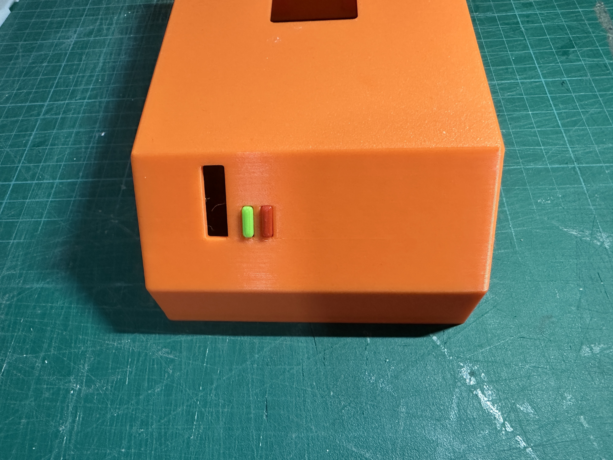
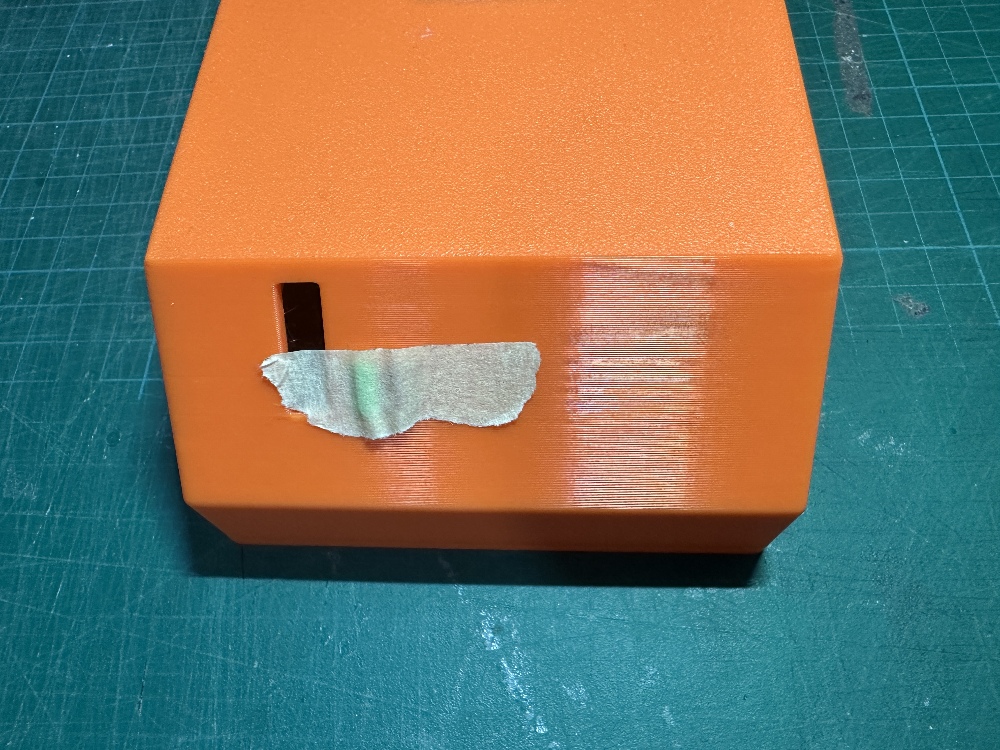

2. **Kabelmanagement:**
   - Prüfen, dass der ESP32-S3 korrekt positioniert ist
   - Alle Drähte frei von der Lastzelle führen
   - Drähte unter oder neben den Komponenten halten, nicht über die Basis hinaus

3. **Abdeckung anbringen:**
   - Abdeckung vorsichtig über die Basis setzen, ohne Drähte einzuklemmen
   - Abdeckung mit den zwei seitlichen Einkerbungen sichern, die in die Basis greifen
   - Klebeband von den Tasten entfernen
   - Tastenfunktion prüfen – die darunterliegenden Board-Tasten sollten spürbar betätigt werden
   - Der vordere vertikale Schlitz zeigt unten drei LEDs und oben eine größere RGB-LED

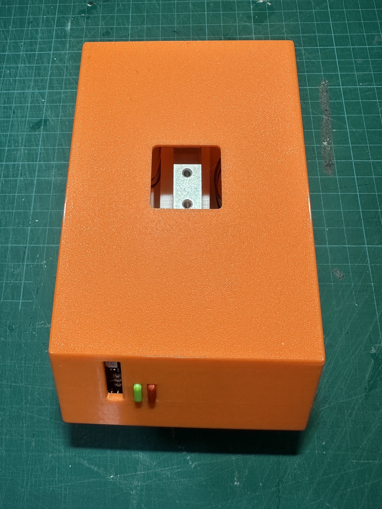

### 8. Platte installieren

1. Die beiden Spulenhalter in die Platte einsetzen:
   - Die abgeschrägte Seite jedes Halters zur Mitte ausrichten
   - Fester Sitz in den Plattenlöchern; evtl. etwas Kraft oder Kleber notwendig

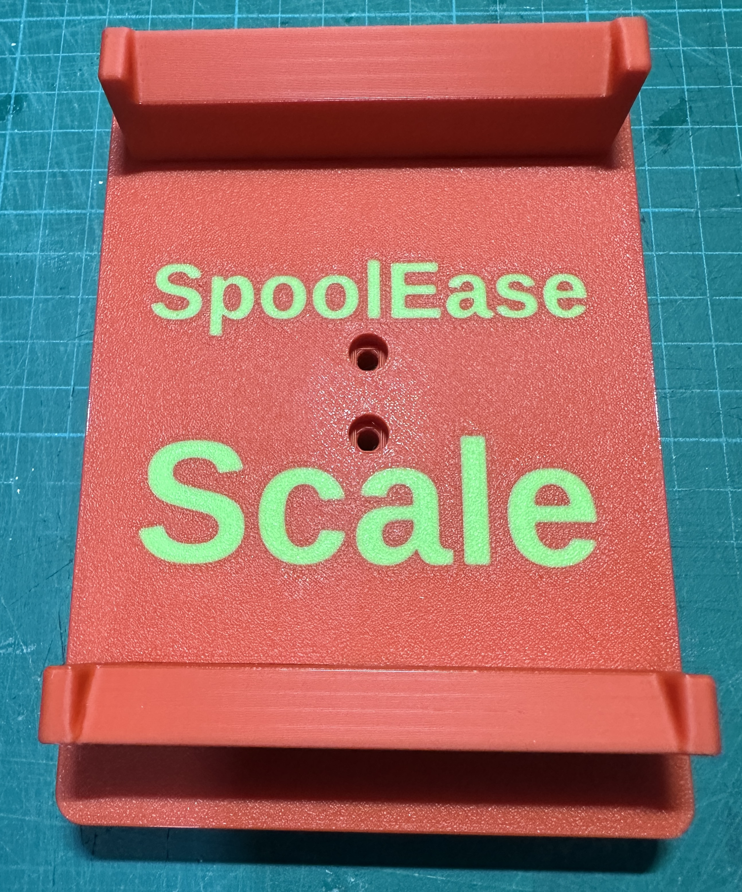

2. Platte montieren:
   - Platte mit Text nach vorne in das obere quadratische Loch des Gehäuses einsetzen
   - Platte mit zwei M4x30-Schrauben an der Lastzelle befestigen

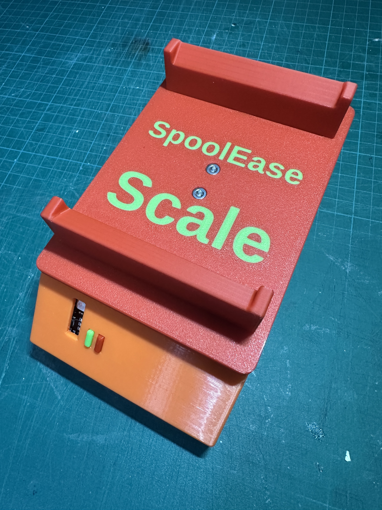

## Herzlichen Glückwunsch!
#### Sie sind stolzer Besitzer der SpoolEase Scale

Fahren Sie fort mit der Einrichtung über den [Scale Setup Guide](scale-setup)
